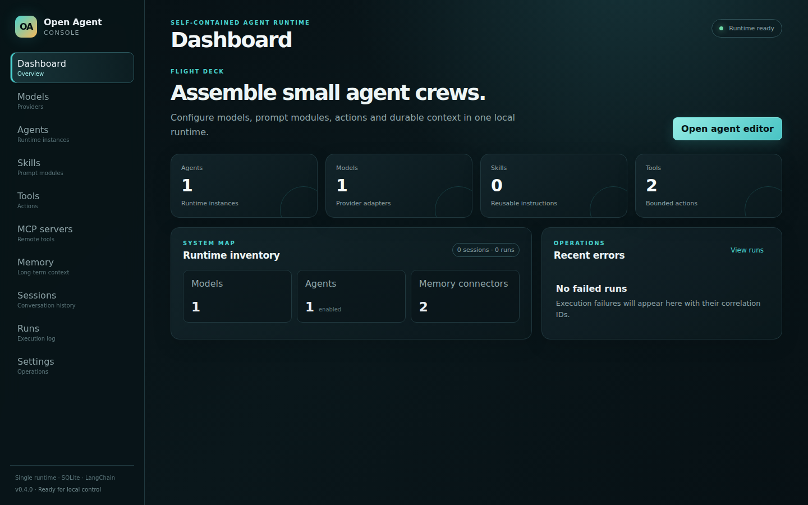
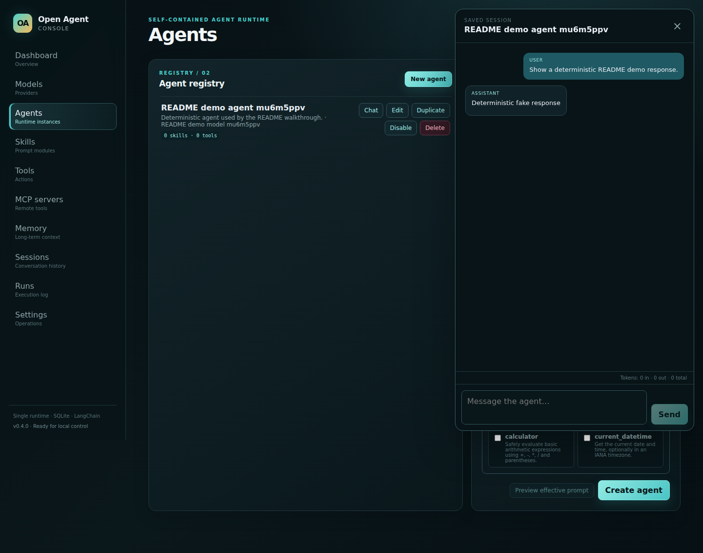
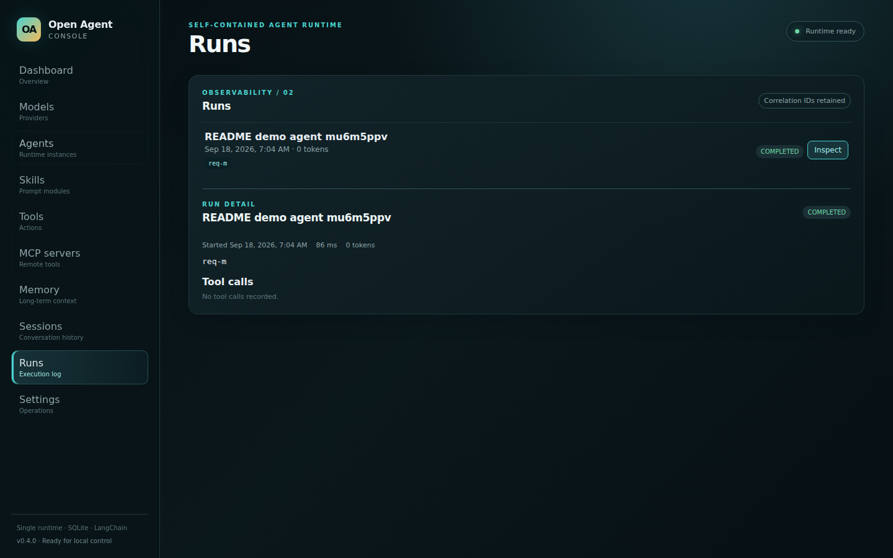

# Open Agent Console

Open Agent Console is a small, self-contained control plane for configuring and running logical AI agents. It provides an authenticated web UI for registering models, composing instructions, attaching tools and memory, starting chats, and inspecting persisted sessions and runs.

The product boundary is intentionally narrow: one TypeScript application, one Node.js process, one SQLite database, and many logical agents in that process. Agents are configuration records, not separate services, containers, or Kubernetes workloads.

## What is included

- Model registry for OpenAI, OpenAI-compatible, Anthropic, Google Gemini, Ollama, and a deterministic fake provider.
- Model connection tests, capability metadata, bounded timeouts, and retries.
- Agent CRUD, duplication, enable/disable, generation settings, and execution limits.
- Ordered reusable skills and effective-prompt preview.
- Built-in calculator/date tools, bounded HTTP tools, and MCP Streamable HTTP discovery.
- None and SQLite long-term-memory connectors.
- Streaming chat over versioned Server-Sent Events (SSE).
- Persisted sessions, messages, attachment references, runs, usage, correlation IDs, and tool calls. Attachments retain bounded metadata and extracted text; original binaries are not uploaded.
- Version 1 registry export/import that excludes credentials and long-term memories.
- SQLite migrations, Docker health/readiness checks, non-root runtime, and CI acceptance coverage.

## Quick start with Docker Compose

Requirements: Docker Engine with Compose v2 and curl. jq is required for the repeatable smoke command.

    cp .env.example .env
    # Add only the provider credentials you need.
    docker compose up --build -d
    curl --fail http://127.0.0.1:3000/api/ready

Open http://127.0.0.1:3000. Compose binds the control panel to localhost, persists the database in the named open-agent-console-data volume, enables a healthcheck, and uses no-new-privileges.

For the demo configuration, sign in with `admin` / `admin` for Admin access or `demo` / `demo` for User access. These values are read from `.env`; replace them before exposing the console.

    docker compose down       # stop, keep data
    docker compose down -v    # stop and delete data intentionally

Use a different environment file with:

    OAC_ENV_FILE=/absolute/path/oac.env docker compose up --build -d

Run the same fake-model acceptance path used by CI with:

    npm run smoke:compose

## Docker image

    docker build -t open-agent-console:local .
    docker run --rm \
      --name open-agent-console \
      -p 127.0.0.1:3000:3000 \
      -v open-agent-console-data:/data \
      --env-file .env \
      open-agent-console:local

The image listens on port 3000, runs as the non-root node user, contains compiled assets and migrations, and stores the default database at /data/open-agent-console.db.

## First-use walkthrough

1. As an Admin, open Settings → Models and add a provider/model. Store only the credential environment-variable name; never enter the secret itself into the registry.
2. Use Test to validate the configured provider/model.
3. In Settings → Agents, create an Agent, select its model, choose its access level (`guest`, `user`, or `admin`), write instructions, and set model/tool-call limits.
4. Optionally create skills, tools, MCP servers, or memories and attach them to the agent.
5. Inspect the effective prompt, open Chat, and send a message.
6. Reopen conversations from the left rail; each conversation keeps its execution activity, usage, correlation IDs, errors, and tool calls together.

The fake provider with model ID deterministic is intended for local development, demonstrations, and automated tests; it never calls an external model.

### Runtime roles

The demo environment provides `admin` / `admin` for Admin access and `demo` / `demo` for User access. Configure them with `OAC_ADMIN_USERNAME`, `OAC_ADMIN_PASSWORD`, `OAC_USER_USERNAME`, and `OAC_USER_PASSWORD`. Add the optional `OAC_GUEST_USERNAME` and `OAC_GUEST_PASSWORD` pair when a signed-in Guest account is needed. Admins manage the registry from Settings. Users can operate enabled agents marked `guest` or `user`. Guests can chat only with enabled agents marked `guest`. Role checks are enforced by the API as well as the navigation.

If no credential accounts are configured, `OAC_ROLE=admin`, `user`, or `guest` keeps the legacy single-role local mode for automation.

## Screenshots and demo

The following captures use the built-in deterministic fake provider, so they do not contain real credentials or external model output.

_Dashboard: registry inventory, runtime readiness, and recent operational state._

_Agent chat: a persisted session with a streamed deterministic response._

_Run detail: completed execution status, correlation ID, duration, and tool-call summary._

[Watch the short browser walkthrough](docs/assets/open-agent-console-demo.webm)

Regenerate the captures locally with Node.js 24+, Chromium, and the development server running:

    HOST=127.0.0.1 PORT=3000 DB_FILE_NAME=/tmp/oac-demo.db npm run dev
    npm run capture:demo

The command writes media to docs/assets. See [docs/assets/README.md](docs/assets/README.md) for capture metadata and reproducibility notes.

## Local development

Requirements: Node.js 24 or newer and npm.

    npm ci
    npm run dev

The Vite UI is at http://127.0.0.1:5173 and proxies /api to Fastify on port 3000. Local development defaults to ./data/open-agent-console.db; startup creates the directory and applies Drizzle migrations.

    npm run typecheck
    npm run lint
    npm test
    npm run test:coverage
    npm run build
    npm run api:check
    npx playwright install chromium
    npm run test:e2e
    npm run capture:demo
    npm run smoke:compose       # requires Docker and jq

Use npm install only when intentionally changing dependencies; review and commit package-lock.json. CI and Docker use npm ci.

## Configuration

### Process variables

| Variable | Default | Purpose |
| --- | --- | --- |
| HOST | 0.0.0.0 | Fastify listen address. Use 127.0.0.1 for local-only access. |
| PORT | 3000 | Fastify listen port. |
| DB_FILE_NAME | ./data/open-agent-console.db | SQLite database path. Docker uses /data/open-agent-console.db. |
| DB_MIGRATIONS_DIR | working-directory/drizzle | Drizzle migration directory. The image uses /app/drizzle. |
| OAC_ADMIN_USERNAME / OAC_ADMIN_PASSWORD | admin / admin | Demo Admin credentials. Replace before exposure. |
| OAC_USER_USERNAME / OAC_USER_PASSWORD | demo / demo | Demo User credentials. Replace before exposure. |
| OAC_GUEST_USERNAME / OAC_GUEST_PASSWORD | unset | Optional Guest credentials. |
| OAC_SESSION_TTL_MS | 28800000 | Session lifetime, clamped to 5 minutes–30 days. |
| OAC_AUTH_COOKIE_SECURE | false | Add the Secure cookie flag when serving over HTTPS. |
| OAC_A2A_PUBLIC_BASE_URL | unset | Trusted external origin advertised in published A2A Agent Cards, for example `https://agents.example.com`. |
| OAC_ROLE | admin | Legacy single-role fallback used only when no credential accounts are configured. |
| OAC_MAX_HISTORY_MESSAGES | 80 | Maximum messages loaded into a run; clamped to 2–10,000. |
| OAC_MAX_HISTORY_CHARS | 120000 | Maximum history characters; clamped to 2,000–1,000,000. |
| OAC_MAX_CONTEXT_CHARS | 100000 | Maximum composed prompt context; clamped to 4,000–500,000. |
| OAC_MAX_MEMORY_ENTRIES | 100 | Maximum SQLite memory rows in a prompt; clamped to 0–10,000. |
| OAC_MCP_TIMEOUT_MS | 15000 | MCP request timeout. |
| OAC_MAX_MCP_RESPONSE_BYTES | 1000000 | Maximum streamed MCP response size. |

### Provider credentials

| Provider | Typical model ID | Credential variable | Base URL |
| --- | --- | --- | --- |
| OpenAI | provider-specific | OPENAI_API_KEY | Optional |
| OpenAI-compatible | provider-specific | e.g. OPENROUTER_API_KEY | Required |
| Anthropic | provider-specific | ANTHROPIC_API_KEY | Optional |
| Google Gemini | provider-specific | GOOGLE_API_KEY | Optional |
| Ollama | local model name | None by default | Optional |
| Fake | deterministic | None | Not used |

At process startup, every configured provider credential is queried for its available model list. Discovered models are registered idempotently in SQLite using the provider, model ID, credential environment variable, and base URL as their source identity. Existing model settings are preserved. A provider discovery failure is logged and skipped so other configured providers can still be registered. OpenRouter uses `OPENROUTER_API_KEY`; an additional OpenAI-compatible provider can be enabled with `OAC_OPENAI_COMPATIBLE_API_KEY` and `OAC_OPENAI_COMPATIBLE_BASE_URL`.

## Runtime overview

    Browser / React
          |
          v
    Fastify REST + SSE
          |
          +--> SQLite registries, sessions, runs, memories
          |
          v
    AgentRuntimeManager
          |
          +--> instructions + ordered skills + memory
          +--> resolved built-in, HTTP, and MCP tools
          +--> bounded LangChain agent runtime
          |
          +--> OpenAI / compatible / Anthropic / Gemini / Ollama / fake

Prepared runtimes are cached. Changes to an agent, model, ordered skills/tools, MCP server, or memory invalidate the relevant cache entry. Session history is owned by SQLite; LangChain is not the persistence source of truth. See [ARCHITECTURE.md](ARCHITECTURE.md) for the complete design.

## Sessions, runs, and transfer

Each chat creates or continues a persisted session. Runs record running, completed, failed, or cancelled status, times, correlation ID, errors, provider usage when available, and context truncation. Tool calls are stored separately with bounded input/output and status.

Registry transfer is not a backup. Version 1 exports models, agents, skills, tools, MCP servers, memory connector configuration, and mappings. It excludes API keys, secret-like header values, memories, sessions, messages, runs, and tool-call history.

## API and contracts

The checked machine-readable contract is [docs/api-reference.json](docs/api-reference.json). The readable endpoint guide is [docs/API.md](docs/API.md). Run npm run api:check after changing routes or request schemas.

| Area | Endpoints |
| --- | --- |
| Health | GET /api/health, GET /api/ready |
| Settings | GET /api/settings |
| Registries | /api/models, /api/agents, /api/skills, /api/tools, /api/mcp-servers, /api/memory-connectors |
| Agent composition | /api/agents/:id/skills, /api/agents/:id/tools, /api/agents/:id/effective-prompt |
| Memory | /api/agents/:id/memories |
| Transfer | GET/POST /api/registry/export and /api/registry/import |
| Sessions/runs | /api/sessions, /api/runs |
| Chat | POST /api/agents/:id/chat (SSE) |
| A2A | /a2a/:slug/.well-known/agent-card.json, /a2a/:slug/message:send, /a2a/:slug/message:stream, /a2a/:slug/tasks |

## Operations and security

The UI supports environment-backed demo authentication with Admin, User, and optional Guest sessions. Keep it on localhost for personal use, use HTTPS with `OAC_AUTH_COOKIE_SECURE=true` when exposing it beyond the host, and still place a trusted authenticated TLS reverse proxy in front of the deployment for production use.

The baseline includes Zod validation, bounded requests and model/tool execution, environment-backed credentials, admin-managed A2A publication with bearer authentication, caller-bound idempotency, quotas, audit events, public DNS validation for HTTP/MCP targets, pinned connections, no HTTP redirects, MCP origin-change rejection, bounded MCP reconnects/output, sanitized Markdown, SQLite foreign keys/WAL/busy timeout, and a non-root image.

Back up SQLite while the application is stopped so the database, -wal, and -shm files remain consistent. Follow [docs/OPERATIONS.md](docs/OPERATIONS.md) for backup, upgrade, rollback, and release procedures.

## CI and releases

Pull requests and pushes to main run install, typecheck, API-contract, lint, unit, coverage, build, browser, Docker, and Compose gates. Successful main pushes publish:

    docker.io/<DOCKERHUB_USERNAME>/open-agent-console:latest
    docker.io/<DOCKERHUB_USERNAME>/open-agent-console:sha-<commit>

Version tags v*.*.* must match package.json. They publish the multi-architecture image first; only then does the workflow create a GitHub release containing the immutable digest and operator notes. Configure DOCKERHUB_TOKEN and, when needed, DOCKERHUB_USERNAME as repository secrets. The default account is bzohdy; DOCKER_USERNAME and DOCKERHUB_USER are accepted aliases.

## Documentation map

| Document | Purpose |
| --- | --- |
| [ARCHITECTURE.md](ARCHITECTURE.md) | Runtime boundaries, persistence, lifecycle, and design decisions |
| [docs/API.md](docs/API.md) | Human-readable REST/SSE usage guide |
| [docs/api-reference.json](docs/api-reference.json) | Generated contract checked by CI |
| [docs/OPERATIONS.md](docs/OPERATIONS.md) | Backup, upgrades, rollback, health checks, and releases |
| [docs/MIGRATIONS.md](docs/MIGRATIONS.md) | Migration compatibility and rollback notes |
| [CONTRIBUTING.md](CONTRIBUTING.md) | Development workflow and change requirements |
| [DESIGN.md](DESIGN.md) | Visual language and UI design tokens |
| [UX-CONTRACT.md](UX-CONTRACT.md) | User-visible behavior and accessibility rules |
| [TODO.md](TODO.md) | A2A delivery status and genuinely outstanding verification work |

## Non-goals

This release is not a workflow builder, distributed runtime, agent-per-container platform, Kubernetes operator, A2A push-notification platform, message-broker system, plugin marketplace, or enterprise IAM product. A2A support is limited to admin-managed, published text agents with HTTP+JSON, optional SSE, bearer/public access, and in-process task execution.

## License

MIT — see LICENSE.
